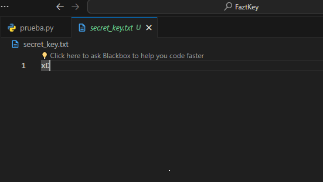

<h1>Encrypted Code - L0123 Algorithm</h1>

> [!NOTE]
pip install encryptedcode

### INFO:
This package is imported absolutely in your .py files, for example: 'from encryptedcode.encrypted_code import encode', and contains two functions, one for encoding called encode() and     another for decoding called decode() using the new L0123 algorithm created by Ing Software Leandro Gonzalez Espinosa.

> [!IMPORTANT]
When using this library for the first time on your PC or virtual environment, it will ask you to provide a secret phrase
You must remember or save this phrase since in order to use the decode function you will need the phrase
for security reasons for you!!!

### USAGE
A simple example of how to use the library is the following:

> [!NOTE]
When you use this library for the first time in your project, it will ask you for a secret phrase which will be hidden from any user from the Windows, Mac or Linux file explorer.

<video src="src/usage.mp4" style="aspect-ratio:16/10" autoplay="True" controls="" loop=""><source src="src/usage.mp4" type="video/mp4"></video>

> [!WARNING]
As time to use the decoding function later it will ask you for the secret phrase that you defined previously. Which is located in your root directory in case you have forgotten it.

</img>